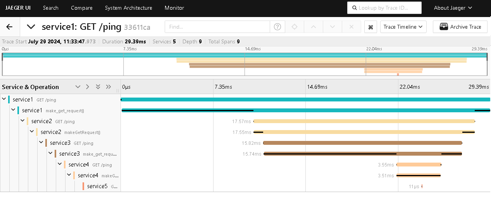

# distributed-tracing-demo
Demo project (python, golang, java)


# Instructions

Create containers
```bash
docker-compose up -d --build
```

Make http-request
```bash
curl -X 'GET' \
  'http://localhost:8001/ping' \
  -H 'accept: application/json'
```

Open Jaeger (Mac)
```bash
open "http://localhost:16686"
```

Open Jaeger (Windows)
```shell
explorer "http://localhost:16686"
```

# Examples

## Python

```python
# Extracting traceparent from headers (FYI)
ctx = get_global_textmap().extract(request.headers)
with tracer.start_as_current_span(f"{request.method.upper()} {request.url.path}", ctx) as span:
    span.set_attribute("language", "python")
```

```python
# Injecting traceparent into headers (FYI)
headers = {}
get_global_textmap().inject(headers)
```

## Golang

```go
// Extracting traceparent from headers (FYI)
ctxParent := propagation.TraceContext{}.Extract(context.Background(), propagation.HeaderCarrier(r.Header))
ctxHandler, spanHandler := app.tracer.Start(ctxParent, fmt.Sprintf("%s %s", r.Method, r.URL.Path))
```

```go
// Injecting traceparent into headers (FYI)
headers := http.Header{}
propagation.TraceContext{}.Inject(ctx, propagation.HeaderCarrier(headers))
```

## Java

```java
// Extracting traceparent from headers (FYI)
Context extractedContext = textMapPropagator.extract(Context.current(), headers, textMapGetter);
Span span = tracer.spanBuilder("GET /ping").setParent(extractedContext).startSpan();
```

```java
// Injecting traceparent into headers (FYI)
Map<String, String> headers = new HashMap<>();
textMapPropagator.inject(Context.current(), headers, textMapSetter);
```

# Screenshots




# Links

- https://www.w3.org/TR/trace-context/#traceparent-header
- https://opentelemetry.io/docs/languages/go/getting-started/
- https://opentelemetry.io/docs/languages/go/instrumentation/
- https://opentelemetry.io/docs/languages/java/getting-started/
- https://opentelemetry.io/docs/languages/java/instrumentation/
- https://opentelemetry.io/docs/languages/python/getting-started/
- https://opentelemetry.io/docs/languages/python/instrumentation/
